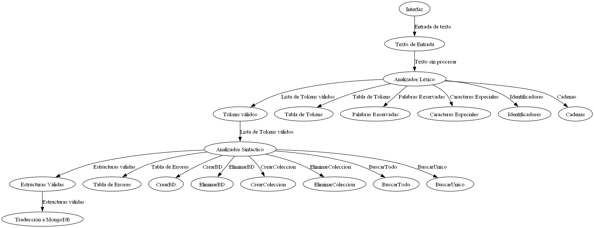

# Lenguajes Formales y de Programación
## PROYECTO 2 TRADUCTOR MONGODB
```js
Universidad San Carlos de Guatemala
Programador: César Augusto Francisco Vicente
Carne: 202200133l
```
---
## MANUAL TECNICO
### Descripción General
El Editor de Código con Analizador Léxico y Sintáctico es una aplicación de software desarrollada en Python que permite a los usuarios escribir, analizar y traducir código a través de una interfaz gráfica. Este manual proporciona información detallada sobre la arquitectura, el funcionamiento interno y los componentes clave del programa.

###  Arquitectura del Programa
El programa está diseñado utilizando el paradigma de programación orientada a objetos (OOP) y sigue una arquitectura de tres capas:

* Capa de Presentación (Interfaz de Usuario): Esta capa se encarga de la interfaz gráfica del programa, implementada utilizando el módulo tkinter de Python. Proporciona una interfaz intuitiva para que los usuarios interactúen con el programa y accedan a sus funciones.
* Capa de Lógica de Negocio: Esta capa contiene la lógica principal del programa, incluidos el análisis léxico y sintáctico del código, la generación de traducciones a MongoDB y la gestión de tokens y errores. Está implementada en los archivos lexico.py y sintactico.py.
* Capa de Acceso a Datos: No se requiere una capa de acceso a datos en este programa, ya que no interactúa con una base de datos u otro sistema de almacenamiento externo.

### Componentes Principales
Los componentes principales del programa son:

1. **Interfaz de Usuario (UI):** Implementada en el archivo main.py, proporciona una interfaz gráfica para que los usuarios interactúen con el programa.
2. **Analizador Léxico:** Implementado en el archivo lexico.py, se encarga de dividir el código en tokens y reconocer elementos léxicos como palabras clave, identificadores y operadores.
3. **Analizador Sintáctico:** Implementado en el archivo sintactico.py, verifica la estructura sintáctica del código según las reglas gramaticales definidas y detecta posibles errores sintácticos.


### Grafo del Programa
El grafo del programa muestra la relación entre los distintos componentes y cómo interactúan entre sí. Aquí está una representación visual del grafo del programa:

Componentes del Grafo:
1. **Interfaz de Usuario (UI):** Representa la interfaz gráfica que interactúa con el usuario.
2. **Analizador Léxico:** Módulo encargado de analizar el código y dividirlo en tokens.
3. **Analizador Sintáctico:** Módulo encargado de verificar la estructura sintáctica del código.
4. **Generador de Traducción a MongoDB:** Módulo responsable de generar traducciones válidas a MongoDB.
5. **Tokens:** Representa los elementos léxicos reconocidos por el analizador léxico.
6. **Errores Léxicos y Sintácticos:** Muestra los errores detectados durante el análisis del código.



### Tecnologías Utilizadas
El programa se desarrolló utilizando Python 3.x y las siguientes bibliotecas:

* tkinter: Para la creación de la interfaz gráfica de usuario.
* Graphviz: Para generar grafos y visualizar la estructura del programa.
os: Para manejar operaciones del sistema operativo, como abrir y guardar archivos.
* filedialog: Para proporcionar diálogos de selección de archivos en la interfaz de usuario.

## Generación de Informes
* Se generan informes detallados de tokens y lexemas, así como de caracteres no permitidos encontrados en el código.

## Limitaciones
* El Editor Simple está diseñado para tareas básicas de edición y traducción de documentos txt. No incluye funcionalidades avanzadas de edición o vista previa interactiva.
* Puede haber limitaciones en la detección de caracteres no permitidos, especialmente si el código txt utiliza caracteres especiales que no están cubiertos por el conjunto de caracteres permitidos.