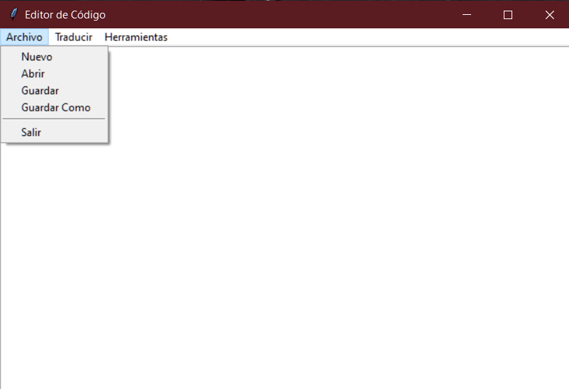
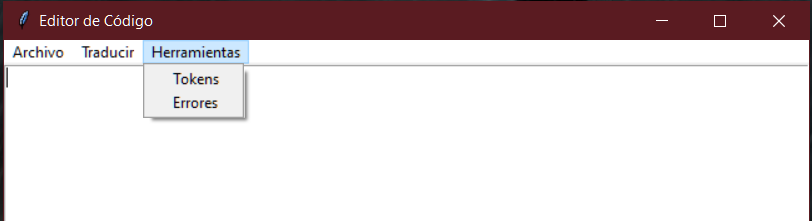

# Lenguajes Formales y de Programación
## PROYECTO 2 TRADUCTOR MONGODB
```js
Universidad San Carlos de Guatemala
Programador: César Augusto Francisco Vicente
Carne: 202200133l
```
---
## MANUAL DE USUARIO
### Descripción General
El Editor de Código con Analizador Léxico y Sintáctico es una herramienta que te permite escribir y analizar código en un entorno intuitivo y eficiente. Este manual te guiará a través de las funciones principales del programa y cómo utilizarlas de manera efectiva.

### Requisitos Del Sistema
Sistema operativo: Windows, macOS o Linux
Python 3.x instalado en el sistema
Bibliotecas adicionales: tkinter, graphviz

### Interfaz Del Editor
El programa presenta una interfaz gráfica simple y fácil de usar, compuesta por las siguientes áreas principales:
* Área de Edición de Código: Aquí puedes escribir y editar tu código.
* Menú: Proporciona acceso a las funciones del programa, como abrir, guardar y traducir archivos, así como herramientas adicionales.
* Botones de Acción: Botones que realizan acciones específicas, como traducir el código, mostrar tokens y errores.

##### Funciones principales
1. **Abrir Archivo:** Permite abrir un archivo de código existente en el editor.
2. **Guardar Archivo:** Guarda el contenido del editor en un archivo.
3. **Traducir:** Analiza el código utilizando el analizador léxico y sintáctico, y genera una traducción a MongoDB si el código es válido.
4. **Mostrar Tokens:** Muestra una tabla con todos los tokens válidos encontrados en el código.
5. **Mostrar Errores:** Muestra una tabla con todos los errores léxicos y sintácticos encontrados en el código.



### Uso del Programa
1. **Abrir y Editar Archivos:** Utiliza el menú "Archivo" para abrir y editar archivos de código.
2. **Guardar Cambios:** Utiliza el menú "Archivo" para guardar tus cambios en el archivo actual.
3. **Traducir el Código:**  Haz clic en el botón "Traducir" para analizar y traducir el código actual a MongoDB.
4. **Ver Tokens:** Haz clic en el botón "Tokens" para mostrar una tabla con todos los tokens válidos encontrados en el código.
5. **Ver Errores:** Haz clic en el botón "Errores" para mostrar una tabla con todos los errores léxicos y sintácticos encontrados en el código.



### Solucion de Problemas
Si encuentras algún problema durante el uso del programa, intenta lo siguiente:
* Verifica que el código esté correctamente escrito y formateado.
* Asegúrate de que los archivos estén guardados con la extensión de archivo correcta.
* Reinicia el programa y vuelve a intentarlo.


